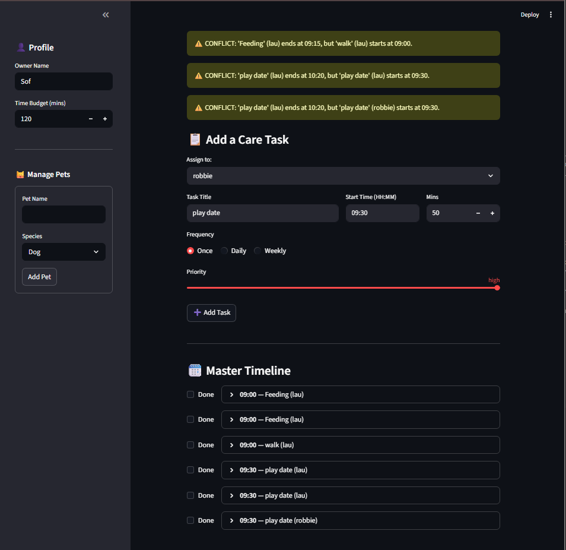

# PawPal+ (Module 2 Project)

You are building **PawPal+**, a Streamlit app that helps a pet owner plan care tasks for their pet.

## Scenario

A busy pet owner needs help staying consistent with pet care. They want an assistant that can:

- Track pet care tasks (walks, feeding, meds, enrichment, grooming, etc.)
- Consider constraints (time available, priority, owner preferences)
- Produce a daily plan and explain why it chose that plan

Your job is to design the system first (UML), then implement the logic in Python, then connect it to the Streamlit UI.

## What you will build

Your final app should:

- Let a user enter basic owner + pet info
- Let a user add/edit tasks (duration + priority at minimum)
- Generate a daily schedule/plan based on constraints and priorities
- Display the plan clearly (and ideally explain the reasoning)
- Include tests for the most important scheduling behaviors

## Getting started

### Setup

```bash
python -m venv .venv
source .venv/bin/activate  # Windows: .venv\Scripts\activate
pip install -r requirements.txt
```

### Suggested workflow

1. Read the scenario carefully and identify requirements and edge cases.
2. Draft a UML diagram (classes, attributes, methods, relationships).
3. Convert UML into Python class stubs (no logic yet).
4. Implement scheduling logic in small increments.
5. Add tests to verify key behaviors.
6. Connect your logic to the Streamlit UI in `app.py`.
7. Refine UML so it matches what you actually built.


### Smarter Scheduling
With the smarter scheduling, the app can automatically warn you if you try to be in two places at once, like walking the dog and feeding the cat at the exact same time. When you finish a "Daily" task, PawPal instantly creates a new one for tomorrow so you never forget to do a py recurring chore. It also helps you prioritize your day by calculating which tasks are the most important to finish within your limited free time. Finally, all your pet's needs are perfectly sorted into a clear timeline from morning to night.

### Features
- **Sorting by time:** Tasks across pets are sortable by their `start_time` string so the scheduler can build a chronological timeline.
- **Value-density selection:** Tasks are ranked using a value-density heuristic (priority weight / duration) so higher-value tasks are chosen first when time is limited.
- **Plan generation within time budget:** The scheduler fits highest-value tasks into the owner's `available_time` without exceeding the budget.
- **Conflict detection & warnings:** Overlapping tasks are detected by converting `start_time` to minutes and comparing end/start windows; human-readable conflict warnings are returned.
- **Recurring tasks (Daily/Weekly):** Marking a recurring task complete returns a new task instance dated for the next occurrence (e.g., +1 day for Daily).
- **Completed-task handling:** Tasks marked completed are not counted as active (non-recurring completed tasks are removed; recurring ones are replaced by the next occurrence).
- **Deterministic tie-breaking:** When priorities/densities tie, the system uses stable ordering (creation order / IDs) to produce deterministic results.
- **Input validation:** The system validates durations, recurrence rules, and task fields and surfaces errors for invalid inputs.
- **Test coverage:** Unit tests verify sorting, conflict detection, recurrence behavior, and selection under constrained time.


### Demo
<a href="C:\Users\Sofia\stanford26\projects\codepath\ai110-show2-pawpal\show2_demo.png" target="_blank"></a