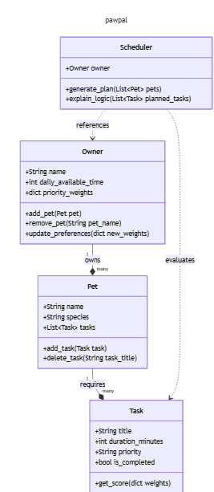

# PawPal+ Project Reflection

## 1. System Design

**a. Initial design**

- Briefly describe your initial UML design.
- What classes did you include, and what responsibilities did you assign to each?

From the instructions on the portal, 3 core actions I identified my scheduler shoudl perform are for the owner to add or remove a pet, to give the owner ability to change their priorities/preferences and to generate a daily schedule based on this potentially udpated information. I created 4 classes for this project: owner, pet, task and scheduler. The class owner has attributes like name, daily_available_time and priority weights with which is a dictionary that maps tasks to ints. Their responsabilities include adding a pet, removing a pet and updating their preferences. I also added a class 'pet' which has a name, species and tasks list as attributes. This class can either add or delete a task. The task class has attributes: title, duration (in minutes), a priority assigned to it and a boolean indicated if it was completed or not. Additionally, there is a get_score function that will allow the owner to reprioritize if necessary, based on other constraints like their energy levels and time avaiable. My UML diagram mapped with mermaid is here: 

**b. Design changes**

- Did your design change during implementation?
- If yes, describe at least one change and why you made it.

---
As I began to implement, Copilot and I noticed that it would be better for tasks to have unique ID's that way a walk for one pet would not be confused for a walk for another pet. Additionally, in order to include both the optimal task and the reason we chose it, I created a result object that includes both the start time and reason. In the first revsion, I included a scoring ration where the value of the score is the given weight over the num of minutes the the task takes. 

## 2. Scheduling Logic and Tradeoffs

**a. Constraints and priorities**

- What constraints does your scheduler consider (for example: time, priority, preferences)?
- How did you decide which constraints mattered most?

**b. Tradeoffs**

- Describe one tradeoff your scheduler makes.
- Why is that tradeoff reasonable for this scenario?

---
a. My scheduler manages tasks by balancing a hard time budget against weighted priority levels (high, medium, and low) for each pet. I prioritized these specific constraints because, for a busy owner, the most valuable schedule is one that fits the most important chores into a strictly limited window of free time.

b. One of the trade offs my implementation has is that it just warns you but doesn't automatically solve a problem when there is task conflict. I think it's reasonable because the owner should still have agency about what happens with their pets, based on their own priorities and preferences, instead of the model deciding for them, in case of conflicts.

## 3. AI Collaboration

**a. How you used AI**

- How did you use AI tools during this project (for example: design brainstorming, debugging, refactoring)?
- What kinds of prompts or questions were most helpful?

**b. Judgment and verification**

- Describe one moment where you did not accept an AI suggestion as-is.
- How did you evaluate or verify what the AI suggested?

---

a. I used AI to verify that my design was on the right track. The handout has pretty helpful hints along the way so for example I knew that I would need Task, Owner, Pet and Scheduler classes, but I wasn't really seeing directly how they would connect and work with each other. Even though, I was able to identify I would need Pet and Owner classes, I still needed some guidance on how the scheduler would fit in. I used mostly Gemini rather than Copilot because last time I ran out of credits so I wanted to save those up for the inline commands that we were asked to complete. The prompts that were most helpful for this project were "Give me an example of a CLI first workflow with a project I've already completed" so I would have a better understanding of the desired approach with content I was already familiar with. 

b. I did not generally accept the AI's docstrings as they were redundant and too long to actually be helpful. I often edited them myself or synthesized with what Copilot said as a starting point. I understood the workflow of the function's implementation to verify the docstring it suggested.

## 4. Testing and Verification

**a. What you tested**

- What behaviors did you test?
- Why were these tests important?

**b. Confidence**

- How confident are you that your scheduler works correctly?
- What edge cases would you test next if you had more time?

---

a. As I review my system I think 3 behaviors that are important to verify are the generation of the schedule (1) with conflict and (2) without conflict. Finally, (3) with singular and multiple pets that have more than one task. In total, I tested the following 8 behaviors:
- test_task_completion: This test confirms that a Task correctly tracks its own state when the mark_complete method is called.
- test_sorting_chronological_order: to validates that the Scheduler uses sorting to rearrange shuffled "HH:MM" strings into a correct morning-to-night timeline.
- test_detect_conflict_flags_overlap: ensuring the system can mathematically identify when two tasks share the same time window and generate a specific warning.
- test_generate_schedule_without_conflict: to check that the generate_plan method can successfully pick multiple tasks that fit within the owner's total time budget.
- test_multiple_pets_multiple_tasks_selection: check the "Value-Density" algorithm correctly prioritizes a high-importance task from one pet over lower-importance tasks from another.
- test_recurring_task_completion_creates_next_day: to verify that completing a "Daily" task triggers the factory logic to create a fresh, uncompleted instance dated exactly 24 hours later.
- test_one_pet_multiple_tasks_order_and_no_conflict: goes through a happy path and is a "sanity check" to ensure that perfectly spaced tasks do not trigger false-positive conflict warnings.

b. I'm pretty confident that my scheduler works correctly. I'll say 4.5 stars since I've been looking at this problem for over 10 hours and everything feels very sound but I'm afraid there might be an edge case I'm missing. I used AI as a second set of eyes but sycophancy might lead it to tell me I'm great and miss a flaw. An edge case I would try to test more explicitly as well is when the pets are different species and they can't complete their tasks in parallel.

## 5. Reflection

**a. What went well**

- What part of this project are you most satisfied with?
I liked the complexity of the task. Thank you for challenging us with a well defined problem. I'm satisified with how algorithms played a role with the scheduler especially because I had seen something similar before in a proofs class for the theory behind the optimal solution. I want to study those algorithms more so I can truly verify what the AI writes for us. 

**b. What you would improve**

- If you had another iteration, what would you improve or redesign?
If  I had a second iteration, I would try to do it again with less AI to check if I actually learned. Although I am beginning to trust it more I still have a hard time being reliant on it. I'm still in college and my main goal is not efficiency right now but deep understanding. The job market does kind of push us to be both efficient and well knowledgeable but I found that by taking it one step at a time, separately, I can get to both. 

**c. Key takeaway**

- What is one important thing you learned about designing systems or working with AI on this project?
CLI first approach was really helpful and made testing and debugging a whooole lot smoother. I liked the scaffolding behind the project and would like to develop my own "phases" for future projects to get a feel of what a standard way to break down a big projet is like. 
